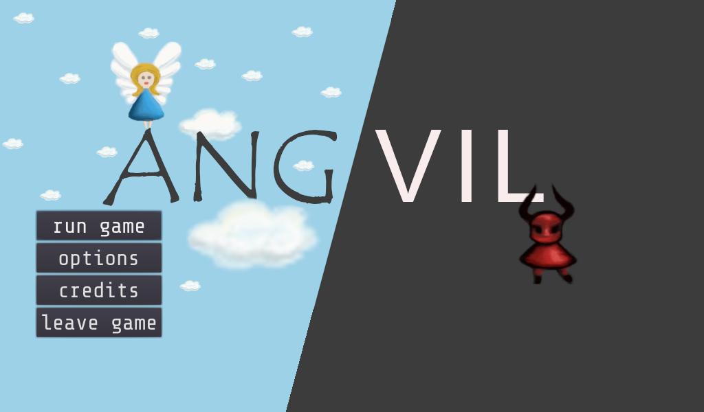

# ANG/VIL

Help devil and angel to solve the levels together.

This game was made for the [Global Game Jam 2022](https://globalgamejam.org/2022/games/angvil-1) in 48 hours.

Thanks to [Fablab Altmühlfranken](https://fablab-altmuehlfranken.de) for providing the jam site.

Play it online on [https://angvil.de](https://angvil.de)

## Downloads
* [Linux](https://angvil.de/angvil.x86_64)
* [Windows](https://angvil.de/angvil.exe)
* [Nintendo Switch](https://angvil.de/angvil.nro)

